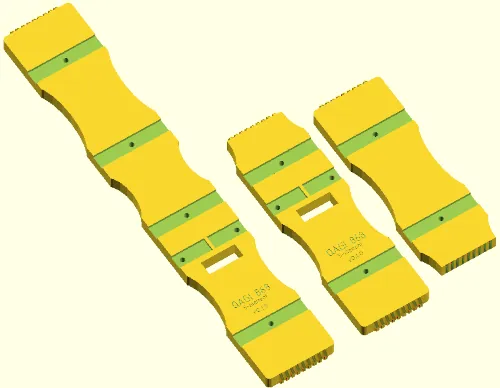
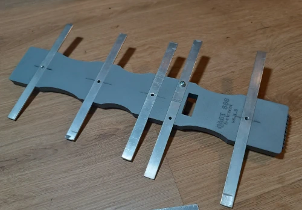

# QAGI Parametric Yagi Antenna Boom

---

A OpenSCAD model for 3D-Printing Yagi-Uda antenna boom.

Uses [BOSL2](https://github.com/BelfrySCAD/BOSL2) library, 
[Osifont](https://github.com/hikikomori82/osifont) 
and [Overpass](https://github.com/RedHatOfficial/Overpass) 
fonts.

Nightly build of OpenSCAD is recommended (tested on version *2026.02.27*).

## Parameters

By default, boom design follows result of 
[3G-Aerial calculator](https://3g-aerial.biz/en/online-calculations/antenna-calculations/dl6wu-yagi-uda-antenna-online-calculator) for
- frequency 869 MHz,
- 5 flat elements,
- 10 mm element width,
- 2 mm element thickness.

Elements are fitting thightly into positions, holes have diameter of 3.5 mm.

Custom trapezoidal connectors are used for modular parts.

---

